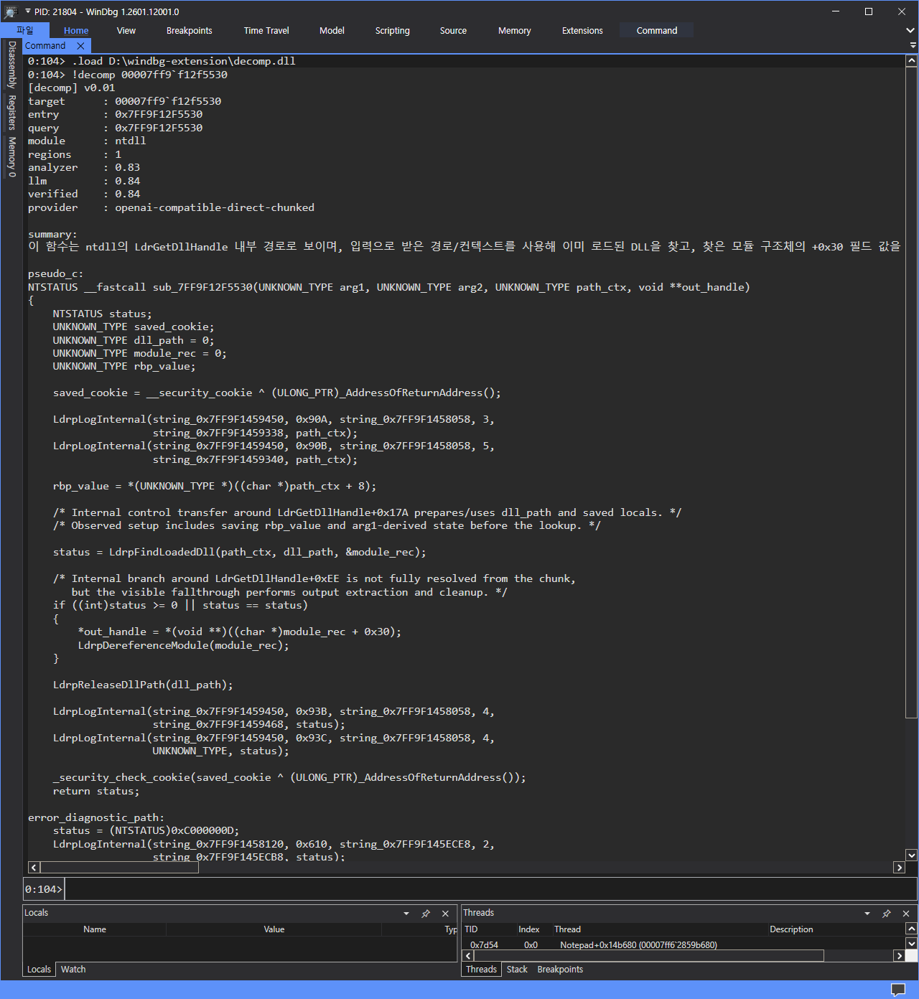

# Windbg Decompile Extension via LLM



This project is a Windows x64 WinDbg extension skeleton that resolves a function by name or address, reconstructs a deterministic control-flow view, and asks an LLM directly from the extension to produce pseudocode.

## Layout

- `src/extension`: WinDbg extension DLL and `!decomp` command.
- `src/shared`: JSON, analyzer, protocol, and verifier code shared by the extension.
- `scripts`: build and vendor-copy helpers.
- `third_party/dbgeng`: optional vendored `dbgeng.h` and `dbgeng.lib` copy.

## Current Scope

- x64-only assumptions
- live-memory analysis through DbgEng
- symbol-region, unwind, and heuristic function-range recovery
- direct in-process LLM calls from the extension
- OpenAI-compatible HTTP adapter or deterministic mock fallback
- verifier pass over LLM output

## Recommended dbgeng Setup

Fastest path is to vendor the header and import library into the project.

Expected vendor layout:

```text
third_party\dbgeng\inc\dbgeng.h
third_party\dbgeng\lib\dbgeng.lib
```

You can copy them manually, or use the helper script.

### Prepare vendor copy from a debugger root

```powershell
powershell -ExecutionPolicy Bypass -File .\scripts\Prepare-DbgengVendor.ps1 `
    -SourceRoot 'C:\Program Files (x86)\Windows Kits\10\Debuggers\x64'
```

### Prepare vendor copy from explicit file paths

```powershell
powershell -ExecutionPolicy Bypass -File .\scripts\Prepare-DbgengVendor.ps1 `
    -HeaderPath 'C:\Program Files (x86)\Windows Kits\10\Debuggers\x64\sdk\inc\dbgeng.h' `
    -LibraryPath 'C:\Program Files (x86)\Windows Kits\10\Debuggers\x64\dbgeng.lib'
```

Once `third_party\dbgeng` exists, `Build.ps1` will prefer it automatically and you usually do not need `DEBUGGERS_ROOT`.

## Build

Recommended path is a Visual Studio Developer PowerShell or Developer Command Prompt.

The built `decomp.dll` now embeds a Windows file version taken from `version.txt`.

### Normal build

```powershell
powershell -ExecutionPolicy Bypass -File .\scripts\Build.ps1 -Reconfigure
```

### Legacy dbgeng build

```powershell
powershell -ExecutionPolicy Bypass -File .\scripts\Build-Legacy.ps1 -Reconfigure
```

### Release build with auto-incremented DLL file version

```powershell
powershell -ExecutionPolicy Bypass -File .\scripts\Invoke-ReleaseBuild.ps1
```

This script increments the last component in `version.txt` by `1`, forces a reconfigure, and then builds the Release DLL. For example, `1.0.0.7` becomes `1.0.0.8`.

### Common options

- `-Configuration Release|Debug`
- `-Clean`
- `-Reconfigure`
- `-ConfigureOnly`
- `-Verbose`
- `-DebuggersRoot 'C:\Program Files (x86)\Windows Kits\10\Debuggers\x64'`
- `-DbgengIncludeDir 'E:\works\windbg_llm_decomp_2\windbg_llm_decomp\third_party\dbgeng\inc'`
- `-DbgengLibrary 'E:\works\windbg_llm_decomp_2\windbg_llm_decomp\third_party\dbgeng\lib\dbgeng.lib'`

### Vendor-first example

```powershell
powershell -ExecutionPolicy Bypass -File .\scripts\Build.ps1 `
    -Configuration Release `
    -Reconfigure `
    -Verbose
```

### Explicit include and library example

```powershell
powershell -ExecutionPolicy Bypass -File .\scripts\Build.ps1 `
    -Configuration Release `
    -DbgengIncludeDir 'E:\works\windbg_llm_decomp_2\windbg_llm_decomp\third_party\dbgeng\inc' `
    -DbgengLibrary 'E:\works\windbg_llm_decomp_2\windbg_llm_decomp\third_party\dbgeng\lib\dbgeng.lib' `
    -Reconfigure
```

The build script automatically tries to locate:

- `cmake.exe` from PATH, standalone CMake, or Visual Studio bundled CMake
- `third_party\dbgeng` under the project root
- `DEBUGGERS_ROOT` from environment variables or common Windows Kits locations

`DEBUGGERS_ROOT` may point to a debugger root that uses one of these layouts:

- `sdk\inc\dbgeng.h` and `sdk\lib\dbgeng.lib`
- `sdk\inc\dbgeng.h` and `sdk\lib\amd64\dbgeng.lib`
- `sdk\inc\dbgeng.h` and `sdk\lib\x64\dbgeng.lib`
- `sdk\inc\dbgeng.h` and `dbgeng.lib`
- `inc\dbgeng.h` and `lib\dbgeng.lib`
- `inc\dbgeng.h` and `lib\amd64\dbgeng.lib`
- `inc\dbgeng.h` and `lib\x64\dbgeng.lib`
- `dbgeng.h` and `dbgeng.lib`

If your installation does not match those layouts, pass the CMake paths directly:

```powershell
cmake -S . -B build-manual -G "Visual Studio 17 2022" -A x64 `
    -DDBGENG_INCLUDE_DIR='E:\works\windbg_llm_decomp_2\windbg_llm_decomp\third_party\dbgeng\inc' `
    -DDBGENG_LIBRARY='E:\works\windbg_llm_decomp_2\windbg_llm_decomp\third_party\dbgeng\lib\dbgeng.lib'
cmake --build build-manual --config Release
```

## Legacy dbgeng Compatibility

If your `dbgeng.h` is too old and the build fails on `GetSymbolEntryOffsetRegions` or `GetSymbolEntryString`, use `Build-Legacy.ps1` or pass the CMake option manually.

With `DECOMP_USE_SYMBOL_ENTRY_APIS=OFF`, the extension falls back to:

- `GetFunctionEntryByOffset` for x64 unwind-based range recovery
- `GetNameByOffset` plus heuristic disassembly if unwind metadata is missing

## LLM Configuration

Place `decomp.llm.json` beside `decomp.dll`.

Example:

```json
{
  "endpoint": "https://api.openai.com/v1/chat/completions",
  "model": "gpt-5.4-2026-03-05",
  "api_key_env": "OPENAI_API_KEY",
  "timeout_ms": 120000,
  "max_completion_tokens": 4000,
  "chunk_trigger_instructions": 512,
  "chunk_trigger_blocks": 24,
  "chunk_block_limit": 14,
  "chunk_count_limit": 20,
  "chunk_completion_tokens": 3500,
  "merge_completion_tokens": 9000
}
```

Supported keys:

- `endpoint`
- `model`
- `api_key`
- `api_key_env`
- `timeout_ms`
- `max_completion_tokens`
- `force_chunked`
- `chunk_trigger_instructions`
- `chunk_trigger_blocks`
- `chunk_block_limit`
- `chunk_count_limit`
- `chunk_completion_tokens`
- `merge_completion_tokens`

Optional environment overrides:

- `DECOMP_LLM_ENDPOINT`
- `DECOMP_LLM_MODEL`
- `DECOMP_LLM_API_KEY`
- `OPENAI_API_KEY`
- `DECOMP_LLM_TIMEOUT_MS`
- `DECOMP_LLM_MAX_COMPLETION_TOKENS`
- `DECOMP_LLM_FORCE_CHUNKED`
- `DECOMP_LLM_CHUNK_TRIGGER_INSTRUCTIONS`
- `DECOMP_LLM_CHUNK_TRIGGER_BLOCKS`
- `DECOMP_LLM_CHUNK_BLOCK_LIMIT`
- `DECOMP_LLM_CHUNK_COUNT_LIMIT`
- `DECOMP_LLM_CHUNK_COMPLETION_TOKENS`
- `DECOMP_LLM_MERGE_COMPLETION_TOKENS`

Quality-first note:

- The extension now supports chunked multi-pass analysis for large functions.
- A good starting point for cloud models is `max_completion_tokens=4000`, `chunk_completion_tokens=3500`, and `merge_completion_tokens=9000`, with chunk triggers around `512 instructions` or `24 blocks`.
- Keep `timeout_ms` high for cloud models. `120000` is a safer starting point than `15000`.
- If quality is still weak on huge functions, raise `chunk_count_limit` before shrinking `/maxinsn`.
- If no endpoint is configured, the extension falls back to the deterministic mock provider.
## WinDbg Usage

```text
.load path\to\decomp.dll
!decomp module!FunctionName
!decomp /deep module!LargeFunction
!decomp /huge module!VeryLargeFunction
!decomp /json 0x140123450
!decomp /no-llm game.exe!CheckIntegrity
```

## WinDbg Smoke Test

1. Build with `Build.ps1` or `Build-Legacy.ps1`.
2. Place `decomp.llm.json` beside the built `decomp.dll`.
3. Start WinDbg. Environment variables are optional overrides only.
4. Load the extension.
5. Validate analyzer-only mode before enabling the LLM path.

```text
.load C:\path\to\decomp.dll
!decomp /no-llm ntdll!RtlAllocateHeap
!decomp /json /no-llm kernel32!Sleep
```

Then validate LLM mode:

```text
!decomp ntdll!RtlAllocateHeap
!decomp /json ntdll!RtlAllocateHeap
!decomp 0x7ffb`12345678
```

Expected checks:

- `target`, `entry`, and `module` should resolve consistently
- `regions` should be non-zero for normal functions
- `/no-llm` should still print analyzer confidence and pseudocode stub
- LLM mode should fill `summary`, `pseudo_c`, and `verified`

## Local LLM Endpoint Examples

### Ollama

```powershell
$env:DECOMP_LLM_ENDPOINT = "http://127.0.0.1:11434/v1/chat/completions"
$env:DECOMP_LLM_MODEL = "qwen2.5-coder:14b"
$env:DECOMP_LLM_API_KEY = "ollama"
```

### LM Studio

```powershell
$env:DECOMP_LLM_ENDPOINT = "http://127.0.0.1:1234/v1/chat/completions"
$env:DECOMP_LLM_MODEL = "local-model"
$env:DECOMP_LLM_API_KEY = "lm-studio"
```

### vLLM or OpenAI-compatible local server

```powershell
$env:DECOMP_LLM_ENDPOINT = "http://127.0.0.1:8000/v1/chat/completions"
$env:DECOMP_LLM_MODEL = "Qwen/Qwen2.5-Coder-14B-Instruct"
$env:DECOMP_LLM_API_KEY = "local"
```


