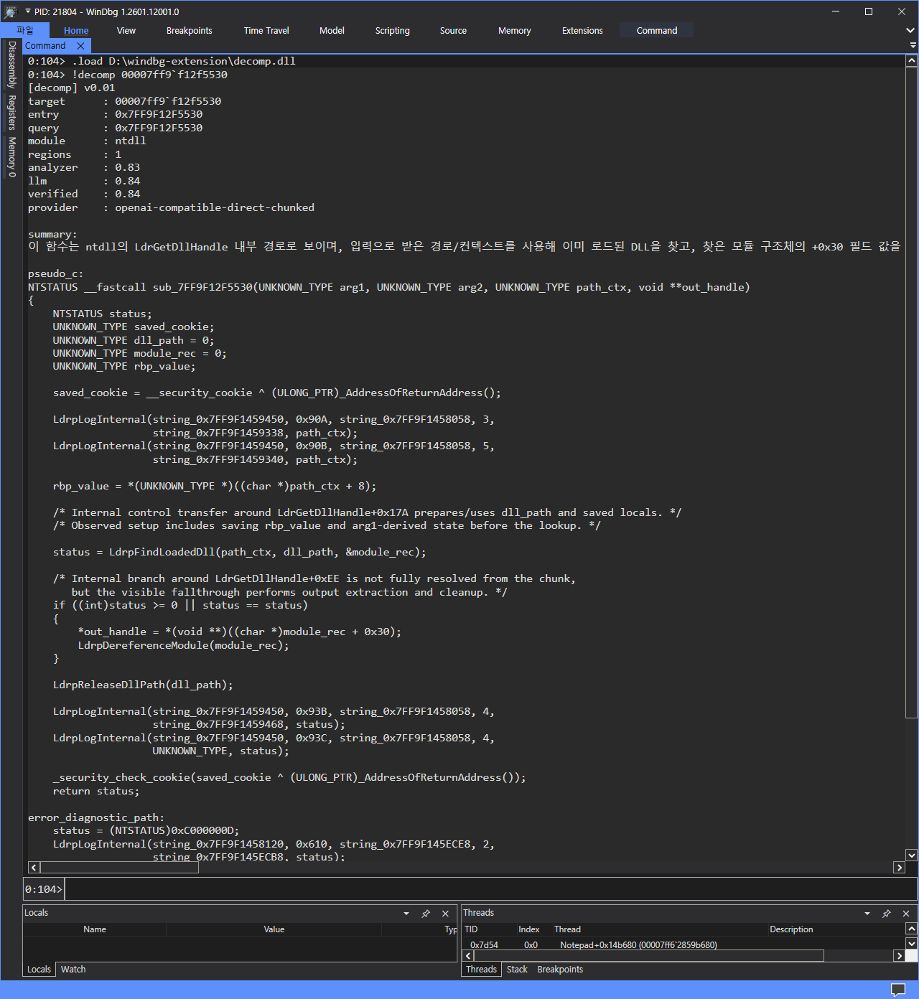

# Windbg Decompile Extension via LLM



This project is a Windows x64 WinDbg extension skeleton that resolves a function by name or address, reconstructs a deterministic control-flow view, and asks an LLM directly from the extension to produce pseudocode.

## Layout

- `src/extension`: WinDbg extension DLL and `!decomp` command.
- `src/shared`: JSON, analyzer, protocol, and verifier code shared by the extension.
- `scripts`: build and vendor-copy helpers.
- `third_party/dbgeng`: optional vendored `dbgeng.h` and `dbgeng.lib` copy.
- `third_party/zydis`: vendored stable Zydis source tree used by default when present.

## Current Scope

- x64-only assumptions
- live-memory analysis through DbgEng
- Zydis-backed structured disassembly for stable mnemonic/operand recovery
- symbol-region, unwind, and heuristic function-range recovery
- SSA-lite style recovery for incoming register arguments, stack-slot locals, merge candidates, and normalized branch conditions
- low-level IR value facts with def-use hints, canonicalized copy/constant expressions, and dead-definition markers
- block-level value state facts for converged live-in/live-out reaching definitions across registers and stack locals
- dominator-backed control-flow region facts for natural loops, if/else candidates, switch candidates, loop induction metadata, and switch range/default metadata
- x64 ABI facts for shadow/home slots, stack pointer deltas, prolog/epilog recognition, no-return calls, tail calls, thunks, import-wrapper candidates, and recovered register/stack call arguments
- SIMD/FP-aware Microsoft x64 argument recovery for `xmm0` through `xmm3`, with vector zero-idiom guards to avoid false incoming arguments
- type recovery hints for pointer-like values, stack locals, field offsets, scaled-index arrays, enum-like compares, bitflag tests, and vtable candidates
- idiom and library-pattern facts for memory/string helpers, security cookies, stack probes, allocators, aggregate initializers, and RIP-relative global/import loads
- call-target facts for direct calls, register/memory indirect calls, virtual-call/vtable-offset candidates, return type, parameter model, side effects, memory effects, ownership hints, and confidence
- evidence graph facts that link high-signal analyzer, PDB, and observed behavior facts back to instruction/block grounding
- refine-first prompting with an analyzer-generated pseudocode skeleton, graph-aware summaries for CFG regions, conditions, and important blocks, ranked high-signal fact selection, and spread sampling for large fact sets
- WinDbg DML links for entry/basic-block/evidence/call-target navigation when the output callback supports DML
- separated result modes for brief, evidence explanation, facts-only, debug prompt, JSON, and data-model style output
- user correction switches for no-return, type, field, and rename hints
- session-aware analysis policy facts for live, dump, kernel, and TTD-like sessions
- observed behavior facts from the current debugger context, including register argument samples, memory hotspots, and TTD query suggestions when available
- RIP-relative string/global/IAT classification and call-target signature hints for LLM prompting
- loaded-PDB aware prototype, scoped parameter/local, field, enum, and source-line hints for LLM prompting
- direct in-process LLM calls from the extension
- OpenAI-compatible HTTP adapter or deterministic mock fallback
- verifier pass over LLM output

## WinDbg Usage

Load the extension from the build output, then run `!decomp` against a symbol or an address:

```text
.load C:\path\to\decomp.dll
!decomp /doctor
!decomp module!FunctionName
!decomp 0x7ffb`12345678
```

Use `/doctor` when setup looks wrong or before enabling an LLM provider:

```text
!decomp /doctor
!decomp /doctor:net
```

- `/doctor` does not require a target and does not call the provider. It reports config path/load status, provider/model/endpoint summary, auth presence without secrets, timeout/token/chunking settings, DML support, session class/qualifier, processor type, and PDB caveats.
- `/doctor:net` is accepted as an explicit network-check request, but currently reports that provider ping is skipped. The extension does not perform a network probe from doctor mode.
- Secret values such as API keys, bearer tokens, refresh tokens, and URL query strings are not printed.

Targets can be public/private symbols, exported function names, or addresses. If the target resolves to an address inside a function, the extension tries to recover the containing function range from symbols, unwind data, and control-flow heuristics. Put quotes around targets that contain spaces:

```text
!decomp "my module!Function With Spaces"
```

The normal command path performs local analysis, builds analyzer facts, optionally calls the configured LLM endpoint, verifies the response against recovered evidence, and prints pseudo-C plus confidence, warnings, and uncertainty notes:

```text
!decomp ntdll!RtlAllocateHeap
!decomp kernel32!Sleep
!decomp game.exe!CheckIntegrity
```

Normal, `brief`, and `explain` output include a compact progress stream even without `/verbose`. Long LLM runs show local-analysis completion, chunk progress, retry notices, merge start, verification, and the Ctrl+Break cancellation hint. Machine-readable modes such as `/view:json`, `/view:facts`, `/view:prompt`, and `/view:data` suppress progress lines and DML helper links so scripts receive only the requested payload.

Use `/view:*` to choose what you want to see. This keeps the command surface small: one option controls all output modes.

```text
!decomp /view:brief module!HotPath
!decomp /view:explain module!BranchyFunction
!decomp /view:json module!FunctionName
!decomp /view:facts module!FunctionName
!decomp /view:prompt module!FunctionName
!decomp /view:data module!FunctionName
!decomp /view:analyzer module!FunctionName
!decomp /view:plan module!FunctionName
```

- `brief` prints target, confidence, summary, and the first uncertainty or verifier warning.
- `explain` adds evidence, control-flow, type-hint, observed-behavior, and call-target sections.
- `json` prints machine-readable request and response JSON.
- `facts` prints only analyzer facts and disables the LLM path.
- `prompt` prints the exact system prompt, user prompt, and prompt facts. It disables the LLM call.
- `data` prints a stable JSON snapshot intended for WinDbg JavaScript/NatVis-style automation.
- `analyzer` renders the deterministic analyzer-only pseudo-code path without calling the LLM.
- `plan` performs local analysis and prints a preflight plan without calling the LLM or updating the result cache. It includes target/module/range counts, PDB availability, session policy, estimated chunking, prompt-size-relevant counts, and practical recommendations.

Use `/verbose` when a command appears stuck or when you want to see the full progress stream:

```text
!decomp /verbose module!SlowFunction
!decomp /verbose /view:json module!SlowFunction
```

- `/verbose` prints local stages such as target resolution, function range recovery, byte reads, disassembly, analyzer fact construction, PDB/session enrichment, pseudo-code tokenization, and verifier results.
- In LLM mode, `/verbose` also prints prompt sizes, request token budgets, HTTP connection/send/receive stages, response chunk sizes, finish reason, extracted model JSON preview, retry attempts, and verifier-feedback retry decisions.
- The API key is not printed. Request/response logs show sizes and short previews rather than full headers or full prompt bodies.
- `/verbose` replaces the compact progress stream with the full trace. Use it when the compact progress lines are not enough to diagnose where time is going.
- During a long-running `!decomp` command, press Ctrl+Break in WinDbg to request cancellation. The extension checks for interrupts between local analysis stages and while waiting for the LLM worker, then asks the active synchronous HTTP I/O to stop.

Legacy aliases such as `/brief`, `/explain`, `/json`, `/facts-only`, `/debug-prompt`, `/data-model`, `/dx`, and `/no-llm` still work for old scripts, but new examples use `/view:*`.

Large functions:

```text
!decomp /limit:deep module!LargeFunction
!decomp /limit:huge module!VeryLargeFunction
!decomp /limit:12000 module!VeryLargeFunction
!decomp /timeout:120000 module!SlowFunction
```

- `/limit:deep` raises the instruction cap to `8192`.
- `/limit:huge` raises the instruction cap to `16384`.
- `/limit:N` sets an explicit instruction cap.
- `/timeout:MS` overrides the request timeout for this invocation.
- LLM chunking is controlled by `decomp.llm.json`; the command-line instruction cap controls how much local code the extension attempts to recover before prompting.
- Legacy `/deep`, `/huge`, and `/maxinsn:N` remain supported.

Cache and replay helpers:

```text
!decomp /view:json module!FunctionName
!decomp /last:json
!decomp /view:explain module!FunctionName
!decomp /last:explain
!decomp /view:facts module!FunctionName
!decomp /last:facts
!decomp /view:data module!FunctionName
!decomp /last:data
!decomp /view:prompt module!FunctionName
!decomp /last:prompt
!decomp /history
!decomp /last:2:explain
!decomp /last:2:json
```

- `/last:json` prints the previous request/response JSON without re-running analysis.
- `/last:explain` re-renders the previous full result with the explain section without re-running analysis or calling the LLM.
- `/last:facts` prints the analyzer facts from the previous result without re-running analysis.
- `/last:data` prints the previous data-model snapshot without re-running analysis.
- `/last:prompt` prints the previous prompt dump without re-running analysis.
- `/history` lists the in-memory result ring buffer. Index `1` is the newest result.
- `/last:N:explain`, `/last:N:json`, `/last:N:facts`, `/last:N:data`, and `/last:N:prompt` replay an older cached result by history index without re-running local analysis or calling the LLM.
- `/last:*` modes are terminal replay commands. If a target is present in the same command, the cached artifact is replayed and no local analysis or LLM request is started for that target.
- In-memory cached artifacts live in the loaded extension instance only. The result history keeps the newest 8 results and disappears when WinDbg unloads the extension or the process exits.
- Successful LLM-backed results are also saved automatically under an `artifact` folder beside the loaded `decomp.dll`. The operator does not need a separate save command.
- Persistent artifacts include `request`, `response`, `data_model`, `debug_prompt`, and a `kernel_build` object with Win32/KD version values, build string, optional `NtBuildLab`, and a build fingerprint.
- On a later session, running the same `!decomp <target>` command automatically checks the `artifact\<kernel_build>\...` path after target resolution and function RVA recovery. If the saved `kernel_build` matches the current OS build, the extension replays the artifact without reading function bytes, running local analyzer passes, or calling the LLM.
- Missing, unreadable, or mismatched persistent artifacts are treated as cache misses. The command falls back to a fresh analysis and overwrites the artifact only after a successful LLM-backed result.
- DML action links in normal output use these cached `/last:*` views, so clicking `explain`, `json`, `facts`, `prompt`, or `data-model` does not start a new decompile run.
- Legacy `/last-json`, `/last-explain`, `/last-facts`, `/last-data-model`, `/last-dx`, and `/last-prompt` remain supported.

DML navigation:

- When WinDbg reports that the current output callback is DML-aware, pseudo-code is syntax-highlighted with configured DML color slots.
- Normal output includes an `actions` row with clickable `explain`, `json`, `facts`, `prompt`, `data-model`, and `history` links for the same target.
- Normal output also includes a `nav` row with entry disassembly, entry breakpoint, and last-artifact replay links.
- Entry addresses, basic blocks, evidence blocks, control-flow regions, type-hint sites, observed memory-hotspot sites, TTD query suggestions, and direct call targets become clickable links where the extension has enough address information.
- Uncertainties and verifier warnings are linked to the best recovered evidence location when the cause can be mapped to a branch, loop, switch, no-return call, return instruction, or function entry.
- If the current output path is not DML-aware, the extension automatically falls back to plain text. The analysis result is the same; only the presentation changes.

Session-aware and observed-behavior details:

- `/view:json`, `/view:facts`, `/view:prompt`, and normal LLM mode include `session_policy`.
- `session_policy` records the debug class, qualifier, execution kind, analysis strategy, dump/live/kernel flags, and whether TTD support appears loaded.
- `observed_behavior` records the current `rip`, `rsp`, return address when readable, Microsoft x64 register argument samples (`rcx`, `rdx`, `r8`, `r9`), repeated memory-access hotspots, and suggested TTD commands.
- Current-frame argument samples are high confidence only when the current instruction pointer is inside the analyzed function. Otherwise they are kept as contextual hints.
- If `ttdext.dll` or `TTDReplay.dll` is loaded in the debugger process, the extension adds suggested `dx @$cursession.TTD.Calls(...)` queries instead of silently pretending trace data was already collected.

User correction switches let you patch analyzer facts from the command line when the debugger lacks enough semantic information:

```text
!decomp /fix:noreturn:FatalError module!FunctionName
!decomp /fix:type:rcx=MY_TYPE* module!FunctionName
!decomp /fix:field:[rcx+18h]=uint32_t module!FunctionName
!decomp /fix:rename:v3=request module!FunctionName
!decomp /fix:clear
```

- `/fix:noreturn:name` treats matching calls as no-return for fallback disassembly, CFG recovery, ABI facts, and verifier checks.
- `/fix:type:expr=TYPE` adds a high-confidence user type hint.
- `/fix:field:expr=TYPE` adds a high-confidence user field hint.
- `/fix:rename:old=new` adds a rename hint and applies the rename to the final pseudocode identifiers.
- `/fix:clear` clears all session-persistent correction overrides.

The environment variable `DECOMP_NORETURN_OVERRIDES` remains supported. Command-line `/fix:noreturn:` values are layered on top of the original environment value for the current WinDbg session.

Correction switches are session-persistent:

- `/fix:noreturn:`, `/fix:type:`, `/fix:field:`, and `/fix:rename:` are remembered by the loaded extension and reused by later `!decomp` runs.
- `/fix:clear` clears all session-persistent corrections and restores the no-return environment override to its original value from extension load time.
- Legacy `/noreturn:`, `/type:`, `/field:`, `/rename:`, and `/clear-overrides` remain supported.

Malformed correction values are ignored and reported in `uncertainties` rather than being cached. For example, `/fix:type:rcx` is ignored because it does not contain an `expr=TYPE` pair.

Recommended investigation workflow:

1. Start with `!decomp /view:facts target` to confirm the function range, blocks, calls, imports, PDB data, and session facts look reasonable.
2. Use `!decomp /view:plan target` to estimate chunking, prompt size, timeout risk, and symbol quality before spending an LLM request.
3. Use `!decomp /view:prompt target` when prompt size, language, or evidence selection looks wrong.
4. Run `!decomp target` for the full verified pseudo-C result.
5. If the result looks wrong, run `!decomp /view:explain target` and inspect verifier warnings, evidence coverage, and suggested fixes.
6. Add focused corrections such as `/fix:noreturn:`, `/fix:type:`, `/fix:field:`, or `/fix:rename:` and re-run the same target.
7. Use `/history` and indexed `/last:N:*` replay when comparing several recent results.
8. Capture `/view:json` or `/last:json` when filing bugs or comparing behavior across builds.

## Analyzer Fact Surface

Recent analyzer facts are intentionally carried through `/view:json`, `/view:facts`, `/view:prompt`, and normal LLM mode. High-value fields to inspect first:

- `stack_pointer` records per-instruction stack deltas, frame-relative aliases, and confidence.
- `call_arguments` records recovered register and stack arguments at call sites, including nearby cross-block stack stores when evidence is strong enough.
- `pdb.prototype_parameters` records structured prototype parameter names, types, ordinals, ABI locations, and source confidence.
- `control_flow` includes loop induction variables, initial values, steps, bounds, direction, switch table address, case targets, default target, range bounds, signedness, and index expression when recovered.
- `callee_summaries` and call-target facts include direct, indirect, and virtual-call/vtable candidates plus known Win32/NT/Rtl memory, allocation, release, and status semantics.
- Prompt fact selection ranks high-signal entries first, then preserves distribution with spread sampling so large functions do not lose all low-frequency evidence.

## Recommended dbgeng Setup

Fastest path is to vendor the header and import library into the project.

Expected vendor layout:

```text
third_party\dbgeng\inc\dbgeng.h
third_party\dbgeng\lib\dbgeng.lib
```

You can copy them manually, or use the helper script.

### Prepare vendor copy from a debugger root

```powershell
powershell -ExecutionPolicy Bypass -File .\scripts\Prepare-DbgengVendor.ps1 `
    -SourceRoot 'C:\Program Files (x86)\Windows Kits\10\Debuggers\x64'
```

### Prepare vendor copy from explicit file paths

```powershell
powershell -ExecutionPolicy Bypass -File .\scripts\Prepare-DbgengVendor.ps1 `
    -HeaderPath 'C:\Program Files (x86)\Windows Kits\10\Debuggers\x64\sdk\inc\dbgeng.h' `
    -LibraryPath 'C:\Program Files (x86)\Windows Kits\10\Debuggers\x64\dbgeng.lib'
```

Once `third_party\dbgeng` exists, `Build.ps1` will prefer it automatically and you usually do not need `DEBUGGERS_ROOT`.

## Recommended Zydis Setup

The repository can use either:

- vendored `third_party\zydis` source
- CMake `FetchContent`

Default behavior is `auto`, which prefers `third_party\zydis` when present and falls back to fetching `Zydis` during CMake configure.

Expected vendor layout:

```text
third_party\zydis\CMakeLists.txt
third_party\zydis\include\Zydis\Zydis.h
third_party\zydis\dependencies\zycore\CMakeLists.txt
```

Refresh or create the vendor copy:

```powershell
powershell -ExecutionPolicy Bypass -File .\scripts\Prepare-ZydisVendor.ps1
```

You can also vendor from an already-downloaded local source tree:

```powershell
powershell -ExecutionPolicy Bypass -File .\scripts\Prepare-ZydisVendor.ps1 `
    -SourcePath 'C:\path\to\zydis'
```

## Build

Recommended path is a Visual Studio Developer PowerShell or Developer Command Prompt.

The built `decomp.dll` now embeds a Windows file version taken from `version.txt`.

### Normal build

```powershell
powershell -ExecutionPolicy Bypass -File .\scripts\Build.ps1 -Reconfigure
```

### Regression tests

```powershell
cmake --build build --config Debug
ctest --test-dir build -C Debug --output-on-failure
cmake --build build --config Release
ctest --test-dir build -C Release --output-on-failure
```

`decomp_snapshot_tests` covers the analyzer/protocol/verifier contracts for recovered stack arguments, SIMD/FP ABI inputs, vector zero-idiom suppression, loop induction preference, switch metadata, virtual-call metadata, known API summaries, prompt fact selection, and verifier grounding checks.

### Legacy dbgeng build

```powershell
powershell -ExecutionPolicy Bypass -File .\scripts\Build-Legacy.ps1 -Reconfigure
```

### Release build with auto-incremented DLL file version

```powershell
powershell -ExecutionPolicy Bypass -File .\scripts\Invoke-ReleaseBuild.ps1
```

This script increments the last component in `version.txt` by `1`, forces a reconfigure, and then builds the Release DLL. For example, `1.0.0.7` becomes `1.0.0.8`.

### Common options

- `-Configuration Release|Debug`
- `-Clean`
- `-Reconfigure`
- `-ConfigureOnly`
- `-Verbose`
- `-ZydisSource Auto|Vendor|Fetch`
- `-ZydisVendorDir 'C:\path\to\zydis'`
- `-DebuggersRoot 'C:\Program Files (x86)\Windows Kits\10\Debuggers\x64'`
- `-DbgengIncludeDir 'E:\works\windbg_llm_decomp_2\windbg_llm_decomp\third_party\dbgeng\inc'`
- `-DbgengLibrary 'E:\works\windbg_llm_decomp_2\windbg_llm_decomp\third_party\dbgeng\lib\dbgeng.lib'`

### Vendor-first example

```powershell
powershell -ExecutionPolicy Bypass -File .\scripts\Build.ps1 `
    -Configuration Release `
    -ZydisSource Vendor `
    -Reconfigure `
    -Verbose
```

### Explicit include and library example

```powershell
powershell -ExecutionPolicy Bypass -File .\scripts\Build.ps1 `
    -Configuration Release `
    -DbgengIncludeDir 'E:\works\windbg_llm_decomp_2\windbg_llm_decomp\third_party\dbgeng\inc' `
    -DbgengLibrary 'E:\works\windbg_llm_decomp_2\windbg_llm_decomp\third_party\dbgeng\lib\dbgeng.lib' `
    -Reconfigure
```

The build script automatically tries to locate:

- `cmake.exe` from PATH, standalone CMake, or Visual Studio bundled CMake
- `third_party\dbgeng` under the project root
- `DEBUGGERS_ROOT` from environment variables or common Windows Kits locations

Zydis source selection works like this:

- `Auto`: prefer `third_party\zydis`, otherwise fetch `Zydis` during configure
- `Vendor`: require a usable `third_party\zydis` tree or the path passed by `-ZydisVendorDir`
- `Fetch`: ignore the vendor tree and always let CMake download `Zydis`

`DEBUGGERS_ROOT` may point to a debugger root that uses one of these layouts:

- `sdk\inc\dbgeng.h` and `sdk\lib\dbgeng.lib`
- `sdk\inc\dbgeng.h` and `sdk\lib\amd64\dbgeng.lib`
- `sdk\inc\dbgeng.h` and `sdk\lib\x64\dbgeng.lib`
- `sdk\inc\dbgeng.h` and `dbgeng.lib`
- `inc\dbgeng.h` and `lib\dbgeng.lib`
- `inc\dbgeng.h` and `lib\amd64\dbgeng.lib`
- `inc\dbgeng.h` and `lib\x64\dbgeng.lib`
- `dbgeng.h` and `dbgeng.lib`

If your installation does not match those layouts, pass the CMake paths directly:

```powershell
cmake -S . -B build-manual -G "Visual Studio 17 2022" -A x64 `
    -DDBGENG_INCLUDE_DIR='E:\works\windbg_llm_decomp_2\windbg_llm_decomp\third_party\dbgeng\inc' `
    -DDBGENG_LIBRARY='E:\works\windbg_llm_decomp_2\windbg_llm_decomp\third_party\dbgeng\lib\dbgeng.lib'
cmake --build build-manual --config Release
```

## Legacy dbgeng Compatibility

If your `dbgeng.h` is too old and the build fails on `GetSymbolEntryOffsetRegions` or `GetSymbolEntryString`, use `Build-Legacy.ps1` or pass the CMake option manually.

With `DECOMP_USE_SYMBOL_ENTRY_APIS=OFF`, the extension falls back to:

- `GetFunctionEntryByOffset` for x64 unwind-based range recovery
- `GetNameByOffset` plus heuristic disassembly if unwind metadata is missing

## PDB Usage

The extension automatically consumes symbols and type information that WinDbg has already loaded for the target modules.

There are two practical levels of PDB enrichment:

- module-level typed facts:
  function name, prototype, return type, global symbol names, field offsets, enum constant names, and source-line hints
- scope-level facts:
  parameter and local names/types from the active debugger scope when the target function matches the current scope or when the extension can switch scope to the function entry

How this affects pseudocode generation:

- recovered register arguments can be renamed from heuristic names like `arg1` to PDB names such as `ctx`
- stack locals can be upgraded from generic slot names to scoped local names and types when available
- pointer-based memory accesses can gain field hints such as `ctx->State`
- enum-like comparisons can gain symbolic names such as `state == StateRunning`
- direct callee summaries can reuse PDB-derived prototypes and return types

Important limitations:

- public PDBs may provide function names and some type data but often do not include scoped locals
- optimized builds can make scoped local values and locations incomplete or ambiguous
- the extension treats PDB data as semantic hints, not as permission to override control flow that is contradicted by disassembly

Current behavior is automatic. There is no separate config switch for PDB usage; the quality depends on what WinDbg has already loaded and whether the current scope can be matched to the target function.

## Configuration

Place `decomp.llm.json` beside `decomp.dll`.

This file is not only for network LLM settings.

- `provider`, `endpoint`, `model`, token budgets, and chunking settings affect the LLM path.
- `display_language` affects the natural language used in summaries and uncertainties.
- `syntax_highlighting` affects pseudo-code rendering in WinDbg when DML-aware output is available.
- `display_language` and `syntax_highlighting` are still used for `/view:analyzer` and mock-provider output.

Example:

```json
{
  "provider": "openai-compatible",
  "endpoint": "https://api.openai.com/v1/chat/completions",
  "model": "gpt-5.4-2026-03-05",
  "api_key_env": "OPENAI_API_KEY",
  "timeout_ms": 120000,
  "max_completion_tokens": 4000,
  "chunk_trigger_instructions": 512,
  "chunk_trigger_blocks": 24,
  "chunk_block_limit": 14,
  "chunk_count_limit": 20,
  "chunk_completion_tokens": 3500,
  "merge_completion_tokens": 9000,
  "display_language": {
    "mode": "auto",
    "tag": "en-US",
    "name": "English"
  },
  "syntax_highlighting": {
    "keyword_color": "warnfg",
    "type_color": "emphfg",
    "function_name_color": "srcid",
    "identifier_color": "wfg",
    "number_color": "changed",
    "string_color": "srcstr",
    "char_color": "srcchar",
    "comment_color": "subfg",
    "preprocessor_color": "verbfg",
    "operator_color": "srcannot",
    "punctuation_color": "srcpair"
  }
}
```

ChatGPT subscription example:

```json
{
  "provider": "chatgpt",
  "model": "gpt-5.5",
  "chatgpt_auth_file": "%USERPROFILE%\\.codex\\auth.json",
  "timeout_ms": 120000,
  "max_completion_tokens": 4000,
  "chunk_completion_tokens": 3500,
  "merge_completion_tokens": 9000,
  "reasoning_effort": "medium"
}
```

For `provider: "chatgpt"`, `endpoint` is optional and defaults to `https://chatgpt.com/backend-api/codex/responses`. A base URL such as `https://chatgpt.com/backend-api/codex` is also accepted and normalized to `/responses`. The extension reads `tokens.access_token` and `tokens.refresh_token` from the configured auth file, refreshes expired JWT access tokens through OpenAI OAuth, and writes the refreshed token set back to that file. The default auth file is `%USERPROFILE%\.codex\auth.json`, so a Codex CLI ChatGPT login can be reused directly. The extension does not launch a browser or start an OAuth login flow from inside WinDbg; if the auth file is missing, invalid, or no longer refreshable, run `codex login` outside WinDbg and retry `!decomp`. For one-off tests, use `access_token` or `access_token_env` instead of an auth file. `api_key`, `api_key_env`, `DECOMP_LLM_API_KEY`, and `OPENAI_API_KEY` are reserved for OpenAI-compatible API-key providers and are ignored by the ChatGPT provider.

Supported keys:

- `provider`
- `endpoint`
- `model`
- `api_key`
- `api_key_env`
- `access_token`
- `access_token_env`
- `chatgpt_auth_file`
- `reasoning_effort`
- `timeout_ms`
- `max_completion_tokens`
- `force_chunked`
- `chunk_trigger_instructions`
- `chunk_trigger_blocks`
- `chunk_block_limit`
- `chunk_count_limit`
- `chunk_completion_tokens`
- `merge_completion_tokens`
- `display_language`
- `syntax_highlighting`

Supported `display_language` keys:

- `mode`
- `tag`
- `name`

`display_language.mode` accepts:

- `auto`
- `fixed`

Supported `syntax_highlighting` keys:

- `keyword_color`
- `type_color`
- `function_name_color`
- `identifier_color`
- `number_color`
- `string_color`
- `char_color`
- `comment_color`
- `preprocessor_color`
- `operator_color`
- `punctuation_color`

How `syntax_highlighting` color values work:

- These values are WinDbg DML color slot names, not fixed RGB or CSS color names.
- The extension passes them through to WinDbg DML as `<col fg="...">`.
- WinDbg resolves each slot name against its current theme and command window color settings.
- Because of that, `verbfg`, `warnfg`, `emphfg`, `srcid`, and similar names do not map to one universal color across every machine.
- There is currently no extension-side config for arbitrary RGB values such as `#FF8800`. The effective color comes from WinDbg, not from `decomp.llm.json`.

Practical consequence:

- If a symbol color looks too dark on one dark theme, the same slot may look acceptable on another machine or another WinDbg theme.
- If two slots look almost identical in your current theme, change the slot names in `syntax_highlighting` rather than assuming the extension is ignoring your setting.
- If you need a truly different final color, change WinDbg's theme or command window color settings so that the slot itself resolves differently.

When highlighting is visible:

- The extension emits DML-colored pseudo-code when WinDbg reports that the current output callbacks are DML-aware.
- If the current debugger output path is not DML-aware, the extension falls back to plain text pseudo-code automatically.
- `/view:json` output is not DML-rendered. Instead, it carries `pseudo_c_tokens` so external tools can apply their own syntax highlighting.

Common DML foreground slots:

- `wfg`
  Default window foreground text.
- `normfg`
  Normal command window text.
- `emphfg`
  Emphasized text. Microsoft documents this as light blue by default, but the exact appearance still depends on theme.
- `warnfg`
  Warning text.
- `errfg`
  Error text.
- `verbfg`
  Verbose text.
- `changed`
  Changed data. Microsoft documents this as red by default.

Common source-oriented DML foreground slots:

- `srcnum`
  Numeric constants.
- `srcchar`
  Character constants.
- `srcstr`
  String constants.
- `srcid`
  Identifiers.
- `srckw`
  Keywords.
- `srcpair`
  Brace or matching-symbol pairs.
- `srccmnt`
  Comments.
- `srcdrct`
  Directives.
- `srcspid`
  Special identifiers.
- `srcannot`
  Source annotations or annotation-like elements.

Examples:

- `verbfg` means "Verbose foreground slot", not "a specific named blue".
- `warnfg` means "Warning foreground slot", not "always yellow or orange".
- `function_name_color: "srcid"` means "render function names using WinDbg's identifier slot".

If you are tuning colors on a dark theme:

- Start with `function_name_color: "emphfg"` or `function_name_color: "verbfg"` if function names look too dim with `srcid`.
- Use `identifier_color: "normfg"` or `identifier_color: "wfg"` for general symbols that should stay readable but not overpower keywords.
- Keep `comment_color: "subfg"` if you want comments to recede without disappearing entirely.

Official reference:

- DML color slot behavior and examples: [Customizing Debugger Output Using DML](https://learn.microsoft.com/en-us/windows-hardware/drivers/debugger/customizing-debugger-output-using-dml)
- Command-window message classes such as normal, warning, error, and verbose: [.printf (WinDbg)](https://learn.microsoft.com/en-us/windows-hardware/drivers/debuggercmds/-printf)

The checked-in [decomp.llm.json.example](F:/kernullist/windbg-decompile-ext/decomp.llm.json.example) contains only valid top-level settings that the extension actually reads.

Reference-only examples:

Follow the PC UI language:

```json
{
  "display_language": {
    "mode": "auto"
  }
}
```

Force English:

```json
{
  "display_language": {
    "mode": "fixed",
    "tag": "en-US",
    "name": "English"
  }
}
```

Force Korean:

```json
{
  "display_language": {
    "mode": "fixed",
    "tag": "ko-KR",
    "name": "Korean"
  }
}
```

Dark syntax-highlighting preset:

```json
{
  "syntax_highlighting": {
    "keyword_color": "warnfg",
    "type_color": "emphfg",
    "function_name_color": "srcid",
    "identifier_color": "wfg",
    "number_color": "changed",
    "string_color": "verbfg",
    "char_color": "srcchar",
    "comment_color": "subfg",
    "preprocessor_color": "normfg",
    "operator_color": "srcannot",
    "punctuation_color": "srcpair"
  }
}
```

Light syntax-highlighting preset:

```json
{
  "syntax_highlighting": {
    "keyword_color": "emphfg",
    "type_color": "warnfg",
    "function_name_color": "srcid",
    "identifier_color": "normfg",
    "number_color": "changed",
    "string_color": "verbfg",
    "char_color": "srcchar",
    "comment_color": "subfg",
    "preprocessor_color": "srcannot",
    "operator_color": "wfg",
    "punctuation_color": "subfg"
  }
}
```

Example `/view:json` response details:

- The JSON response includes `pseudo_c` and `pseudo_c_tokens`.
- `pseudo_c_tokens` is a deterministic token stream suitable for external syntax highlighting.
- The serialized request includes `preferred_natural_language_tag` and `preferred_natural_language_name`, which reflect the resolved display language after applying `display_language.mode`.
- Analyzer facts now include P0 quality fields:
  `ir_values`, `block_value_states`, `control_flow`, and `abi`.
- `ir_values` exposes SSA-like value ids, definition sites, targets, canonical expressions, use links, constant/copy flags, and dead-definition hints.
- `block_value_states` exposes per-basic-block live-in/live-out reaching definitions, canonical values, storage class, convergence state, and confidence.
- `stack_pointer` exposes per-instruction stack deltas, frame-relative aliases, raw base/offsets, and confidence.
- `control_flow` exposes structured region candidates such as `natural_loop`, `if_else_candidate`, and `switch_candidate` with block evidence, loop induction metadata, switch table/default/range metadata, signedness, index expressions, and confidence.
- `abi` exposes Microsoft x64 shadow-space assumptions, home-slot evidence, frame/prolog/epilog recognition, no-return call evidence, tail-call candidates, thunk candidates, import-wrapper candidates, and recovered call arguments from registers and stack stores.
- Analyzer facts now also include P1 semantic fields:
  `type_hints`, `idioms`, and `callee_summaries`.
- `type_hints` exposes pointer, local, field-offset, array-like, enum-like, bitflag-like, and vtable-candidate evidence with source and confidence. When PDB data is available, scoped params/locals, field hints, and enum constants are also promoted into this unified type-hint stream.
- `idioms` exposes higher-level replacements for recognized helper calls and compiler patterns such as memory copy/fill, string copy, security cookie checks, stack probes, allocation/free helpers, aggregate initializers, and RIP-relative global/import loads.
- `callee_summaries` exposes direct and indirect callee return-type, parameter-model, side-effect, memory-effect, ownership, source, and confidence hints; symbol/type-enriched call targets replace the initial heuristic summaries when WinDbg can resolve them, and virtual-call candidates include target expressions plus vtable offsets when recovered.
- Known Win32/NT/Rtl API summaries describe memory copy/fill/zero, allocation, release, status, and error behavior when symbol names are available.
- Prompt facts include `analyzer_skeleton` and `graph_summary` so the model refines an evidence-backed draft instead of starting from a blank page.
- `graph_summary` provides entry block, control-flow regions, normalized conditions, and representative high-signal blocks with an explicit truncation policy. Prompt fact selection now ranks high-signal entries and uses spread sampling to keep large fact sets representative.
- `evidence_graph` exposes high-signal fact nodes and provenance edges so IR values, block value states, memory accesses, call targets, type hints, PDB hints, and observed behavior can be traced back to instruction and block evidence.
- The verifier response includes legacy `warnings` plus structured `issues` entries. Each issue carries `severity`, `code`, `message`, and optional `evidence` so tools can filter errors such as `branch.true_target_not_successor` separately from lower-risk warnings.
- Verifier checks now compare normalized branch true/false targets against CFG successors, compare pseudo-code branch density against recovered conditional branches, cross-check direct callee summaries against pseudo-code call effects, validate evidence-graph node/edge grounding, and check block value state references back to recovered blocks and IR values.
- Normal and explain output may include a concise `suggested fixes` section. These are conservative `/fix:*` commands derived from verifier issues, PDB-backed rename opportunities, or repeated observed memory hotspots. DML-aware output renders immediately applicable suggestions as clickable rerun links for the same target; placeholder field-type suggestions remain plain text until `TYPE` is replaced.
- In LLM mode, the extension automatically feeds verifier issues back into one retry prompt. The retry is kept when it preserves or improves verifier quality; otherwise the original response is retained with an added uncertainty note.
- `session_policy` and `observed_behavior` expose WinDbg-specific context such as live/dump/kernel/TTD-like policy, current-frame register argument samples, memory hotspots, and suggested trace queries.
- The serialized request now also includes a `pdb` object when symbol/type data is available.
- `pdb.availability` reports the enrichment level such as `none`, `symbols`, `typed`, or `scoped`.
- `pdb.params`, `pdb.locals`, `pdb.field_hints`, `pdb.enum_hints`, and `pdb.source_locations` are intended as machine-readable semantic hints for external tooling or offline analysis.

Optional environment overrides:

- `DECOMP_LLM_PROVIDER`
- `DECOMP_LLM_ENDPOINT`
- `DECOMP_LLM_MODEL`
- `DECOMP_LLM_API_KEY`
- `OPENAI_API_KEY`
- `DECOMP_LLM_CHATGPT_ACCESS_TOKEN`
- `DECOMP_LLM_CODEX_ACCESS_TOKEN`
- `KERNFORGE_CODEX_ACCESS_TOKEN`
- `DECOMP_LLM_CHATGPT_AUTH_FILE`
- `DECOMP_LLM_CODEX_AUTH_FILE`
- `KERNFORGE_CODEX_AUTH_FILE`
- `DECOMP_LLM_REASONING_EFFORT`
- `DECOMP_LLM_TIMEOUT_MS`
- `DECOMP_LLM_MAX_COMPLETION_TOKENS`
- `DECOMP_LLM_FORCE_CHUNKED`
- `DECOMP_LLM_CHUNK_TRIGGER_INSTRUCTIONS`
- `DECOMP_LLM_CHUNK_TRIGGER_BLOCKS`
- `DECOMP_LLM_CHUNK_BLOCK_LIMIT`
- `DECOMP_LLM_CHUNK_COUNT_LIMIT`
- `DECOMP_LLM_CHUNK_COMPLETION_TOKENS`
- `DECOMP_LLM_MERGE_COMPLETION_TOKENS`
- `DECOMP_NORETURN_OVERRIDES`
  Comma- or semicolon-separated function-name fragments treated as no-return targets during fallback disassembly, CFG successor recovery, ABI facts, and verifier checks. Example: `DECOMP_NORETURN_OVERRIDES=MyAbort;PanicAndExit`.

Quality-first note:

- The extension now supports chunked multi-pass analysis for large functions.
- The analyzer sends IR value facts, block value states, control-flow regions, evidence graph facts, and x64 ABI/no-return evidence to the LLM before refinement, so `/view:analyzer`, `/view:json`, and normal LLM mode all share the same P0 evidence base.
- The verifier cross-checks loop, switch, no-return, branch targets, return behavior, callee call effects, evidence graph grounding, block value state consistency, evidence coverage, and suspicious identifier claims against analyzer evidence. It lowers trust when confident prose outruns recovered facts and labels each issue with a stable severity/code pair.
- When verifier feedback finds schema errors, fact conflicts, or very low adjusted confidence, the LLM path performs one automatic retry with the verifier issues appended to the prompt.
- A good starting point for cloud models is `max_completion_tokens=4000`, `chunk_completion_tokens=3500`, and `merge_completion_tokens=9000`, with chunk triggers around `512 instructions` or `24 blocks`.
- Keep `timeout_ms` high for cloud models. `120000` is a safer starting point than `15000`.
- If quality is still weak on huge functions, raise `chunk_count_limit` before shrinking `/limit:N`.
- If no endpoint is configured, the extension falls back to the deterministic mock provider.
- Even when the extension is using `/view:analyzer` or the mock provider, `display_language` and `syntax_highlighting` still affect what the user sees.

## WinDbg Smoke Test

1. Build with `Build.ps1` or `Build-Legacy.ps1`.
2. Place `decomp.llm.json` beside the built `decomp.dll`.
3. Start WinDbg. Environment variables are optional overrides only.
4. Load the extension.
5. Validate analyzer-only mode before enabling the LLM path.

```text
.load C:\path\to\decomp.dll
!decomp /view:analyzer ntdll!RtlAllocateHeap
!decomp /view:facts kernel32!Sleep
```

Then validate LLM mode:

```text
!decomp ntdll!RtlAllocateHeap
!decomp /view:json ntdll!RtlAllocateHeap
!decomp 0x7ffb`12345678
```

Expected checks:

- `target`, `entry`, and `module` should resolve consistently
- `regions` should be non-zero for normal functions
- `/view:analyzer` should still print analyzer confidence and pseudocode stub
- LLM mode should fill `summary`, `pseudo_c`, `pseudo_c_tokens`, and `verified`
- `/view:json` output should include `preferred_natural_language_tag` and `preferred_natural_language_name` in the serialized request
- when private or rich PDBs are loaded, `/view:json` should also include `pdb.prototype`, `pdb.params`, and possibly `pdb.locals`
- for typed structs and enums, `/view:json` may include `pdb.field_hints` and `pdb.enum_hints`

## ChatGPT Subscription Example

```powershell
$env:DECOMP_LLM_PROVIDER = "chatgpt"
$env:DECOMP_LLM_MODEL = "gpt-5.5"
$env:DECOMP_LLM_CHATGPT_AUTH_FILE = "$env:USERPROFILE\.codex\auth.json"
$env:DECOMP_LLM_TIMEOUT_MS = "120000"
```

If the auth file contains a refresh token, the extension refreshes an expired access token before sending the request. `DECOMP_LLM_CHATGPT_ACCESS_TOKEN` can be used for a temporary bearer token, but the auth-file path is better for normal WinDbg sessions because it survives token expiry. The extension never opens a browser during `!decomp`; run `codex login` outside WinDbg when an interactive ChatGPT login is needed.

## Local LLM Endpoint Examples

### Ollama

```powershell
$env:DECOMP_LLM_ENDPOINT = "http://127.0.0.1:11434/v1/chat/completions"
$env:DECOMP_LLM_MODEL = "qwen2.5-coder:14b"
$env:DECOMP_LLM_API_KEY = "ollama"
```

### LM Studio

```powershell
$env:DECOMP_LLM_ENDPOINT = "http://127.0.0.1:1234/v1/chat/completions"
$env:DECOMP_LLM_MODEL = "local-model"
$env:DECOMP_LLM_API_KEY = "lm-studio"
```

### vLLM or OpenAI-compatible local server

```powershell
$env:DECOMP_LLM_ENDPOINT = "http://127.0.0.1:8000/v1/chat/completions"
$env:DECOMP_LLM_MODEL = "Qwen/Qwen2.5-Coder-14B-Instruct"
$env:DECOMP_LLM_API_KEY = "local"
```


